# UNITY作业9-汽车尾气

演示视频：仓库中演示.mp4

## 题目

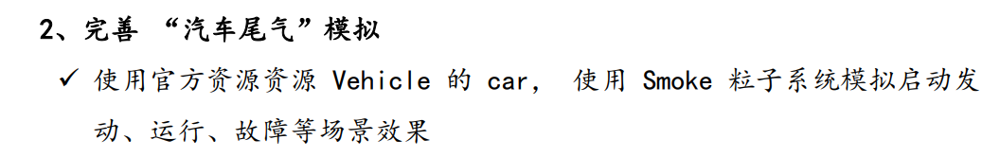

## 实现思路

本次作业用到了官方资源Standard Assets中的Vehicle资源，使用其中的car，并在此基础上使用smoke系统来模拟运行和故障两个粒子效果。

这里我们在car的预制下挂载两个空物体whiteSmoke和blackSmoke，如下图。

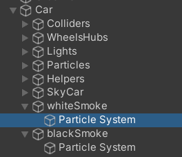

这两个空物体用于挂载粒子系统Particle System。whiteSmoke上挂载对应运行时的白烟粒子系统，blackSmoke则对应故障时的黑烟。系统的组成部分如下。

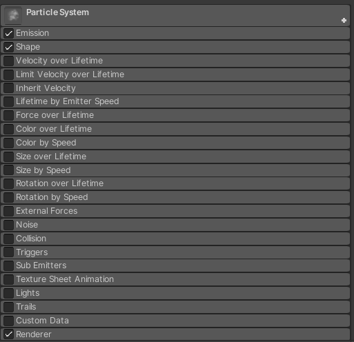

白烟的总控参数、Shape和Emission调整如下。

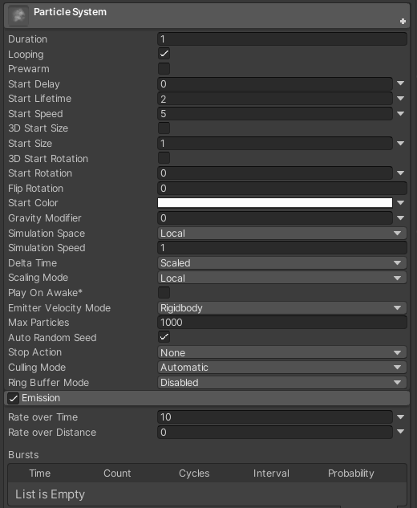

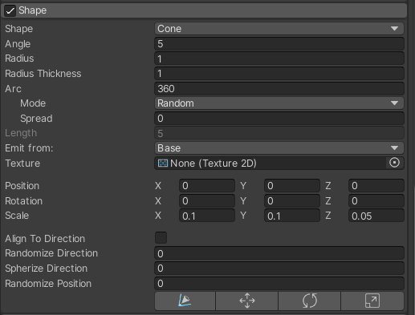

黑烟的总控参数、Shape和Emission调整如下。

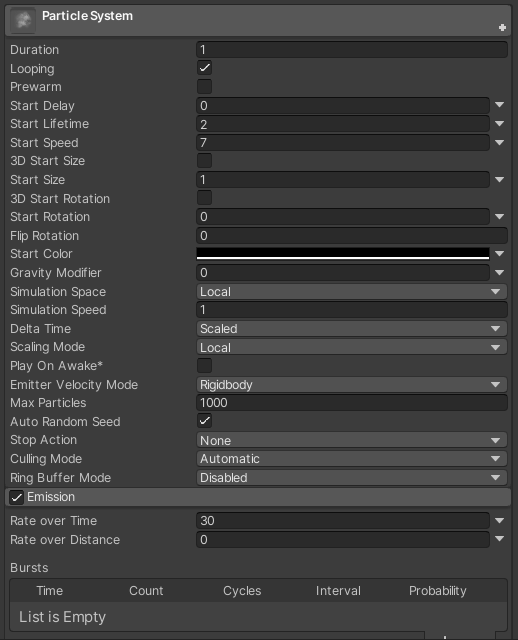

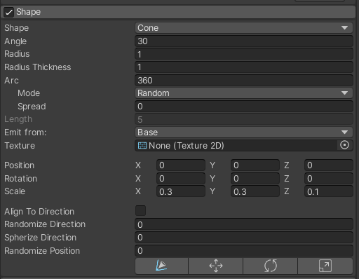

然后写一个简单的脚本来进行控制，脚本如下。

```csharp
using System.Collections;
using System.Collections.Generic;
using UnityEngine;

public class myGUI : MonoBehaviour{
    public ParticleSystem whiteSmoke;
    public ParticleSystem blackSmoke;
    public GameObject car;
    bool carStart = false;
    bool err = false;
    // Start is called before the first frame update
    void Start(){
        Debug.Log("start");
        whiteSmoke = car.transform.GetChild(6).GetChild(0).GetComponent<ParticleSystem>();
        blackSmoke = car.transform.GetChild(7).GetChild(0).GetComponent<ParticleSystem>();
        if(whiteSmoke == null || blackSmoke == null){
            Debug.Log("null");
        }
    }

    // Update is called once per frame
    void Update(){

    }
    private void OnGUI(){
        if(GUI.Button(new Rect(0.7f * Screen.width, 100, 150, 35),"汽车发动") && !carStart){
            whiteSmoke.Play();
            carStart = true;
        }
        if (GUI.Button(new Rect(0.7f * Screen.width, 140, 150, 35),"故障") && !err){
            blackSmoke.Play();
            err = true;
        }
        if (GUI.Button(new Rect(0.7f * Screen.width, 60, 150, 35),"汽车停止") && carStart){
            whiteSmoke.Stop();
            carStart = false;
        }
        if (GUI.Button(new Rect(0.7f * Screen.width, 180, 150, 35),"故障解除") && err){
            blackSmoke.Stop();
            err = false;
        }
    }

}
```

脚本被挂载在一个空物体上，将car绑定到脚本上。

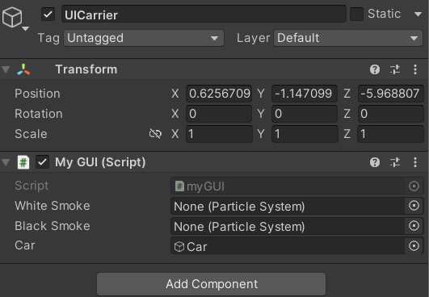

## 效果

UI界面

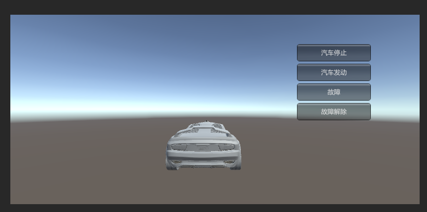

汽车启动

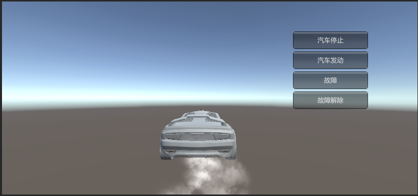

故障

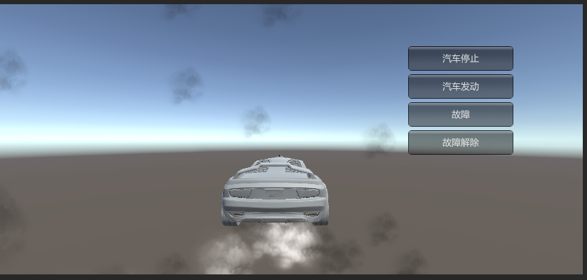
